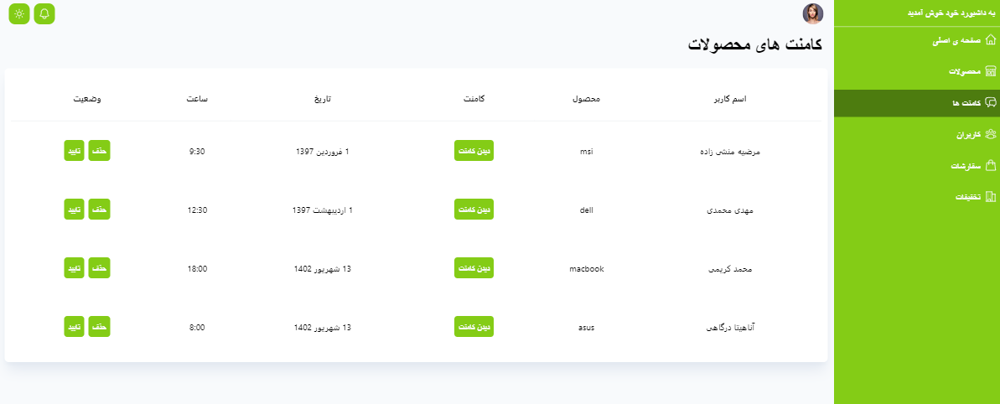

# Rtl-Cms
This is a react js + typescript project bootstrapped with vite.
Please turn on your vpn first, then click on the link below
> Live demo [https://rtl-cms.vercel.app/](https://rtl-cms.vercel.app/)
## Technologies Used

  

## Features

You can :
- add product
- delete product
- edit product
- add user
- delete user
- edit user
- delete comment
- confirmation
- use dark mood
- and etc...

## Screenshots

## Project Status

Project is: _finished

## Contact

Created by Marzieh Monshizadeh :)

